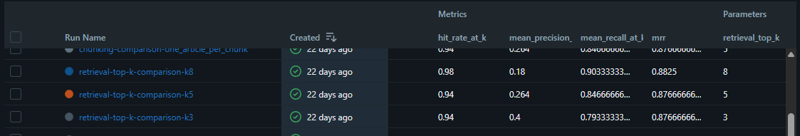
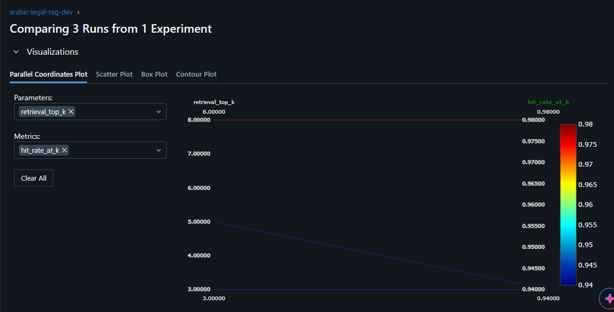
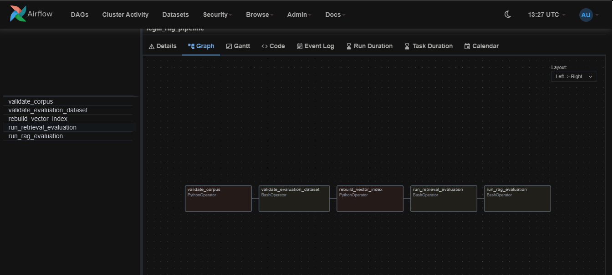
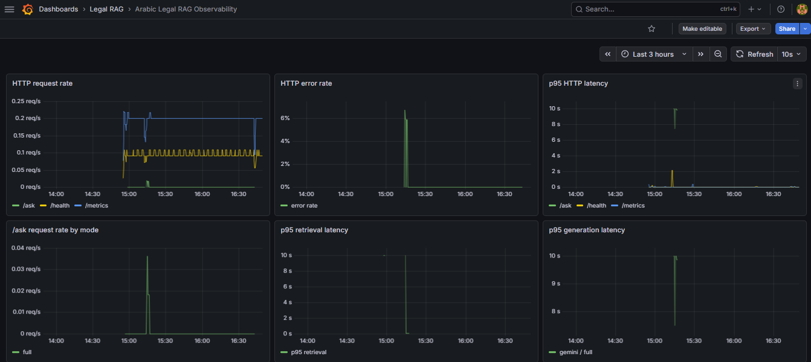
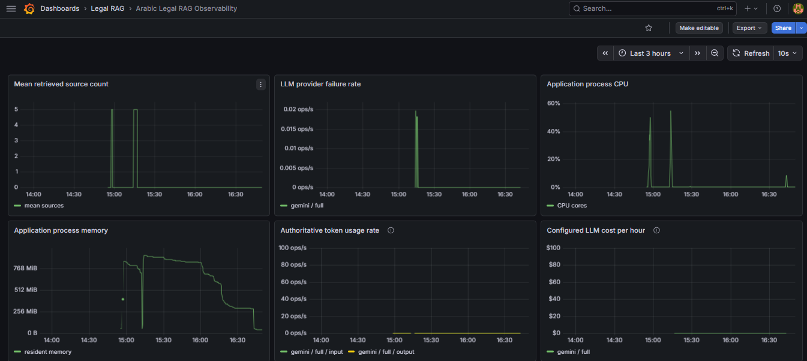
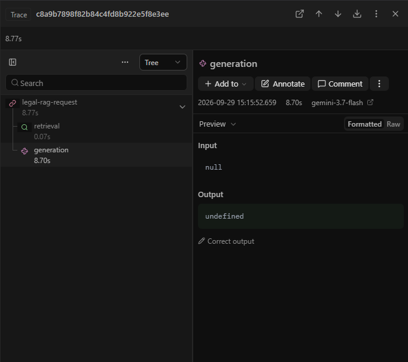

# Arabic Legal RAG MLOps

An Arabic legal-document retrieval-augmented generation system grounded in the
Egyptian Civil Code. It retrieves relevant provisions from PostgreSQL/pgvector,
generates an informational answer through a configurable LLM provider, and
returns traceable legal sources. The canonical JSON corpus remains the source of
truth; the vector database is a rebuildable serving index.

This is a portfolio and engineering baseline, not professional legal advice or
a claim of complete production readiness.

## Architecture and status

```text
Egyptian Civil Code JSON (DVC)
  -> validated loader
  -> one article per chunk
  -> multilingual-e5-small embeddings (local)
  -> PostgreSQL + pgvector
  -> semantic retriever (top_k=5)
  -> Gemini or OpenAI-compatible vLLM
  -> LegalRAGService
  -> FastAPI baseline / BentoML service
  -> nginx weighted canary
```

- Module 0: corpus extraction, normalization, and audit artifacts.
- Module 1: loader, indexing, retrieval, grounded generation, API, and Docker.
- Module 2: MLflow experiments, 50-case evaluation, RAGAS integration, DVC,
  quality gates, and CI.
- Module 3: Airflow orchestration, BentoML, optional vLLM, HTTP/SSE streaming,
  Locust scenarios, bounded provider retries, canary release, and Docker Hub
  publishing automation.
- Module 4: Prometheus metrics, a provisioned Grafana dashboard,
  privacy-conscious Langfuse tracing, offline query-embedding drift, PII
  redaction, authoritative provider token accounting, and configurable USD
  cost accounting.

The production defaults remain one legal article per chunk and `top_k=5`.
Gemini remains the default generator; vLLM is an optional OpenAI-compatible
backend.

## Core stack

Python 3.12, FastAPI, BentoML, Sentence Transformers
(`intfloat/multilingual-e5-small`), PostgreSQL/pgvector, Psycopg, Gemini,
OpenAI-compatible vLLM HTTP APIs, MLflow, DVC, Airflow, Locust, nginx, Docker
Compose, Prometheus/Grafana, Langfuse, Ruff, pytest, pre-commit, and GitHub
Actions.

## Repository layout

```text
src/legal_rag/        application, ingestion, retrieval, generation, evaluation
data/                 DVC-managed corpus/evaluation data and Module 0 audits
docker/               PostgreSQL initialization
orchestration/dags/   manual Airflow maintenance/evaluation DAG
serving/              isolated BentoML dependency
loadtest/             controlled target and Locust scenarios
release/              BentoML image, nginx canary, rollback configuration
docs/                 focused serving, streaming, load, and release guides
monitoring/           Prometheus configuration and provisioned Grafana dashboard
evidence/             durable exports of verified experiment results
tests/                unit, API, orchestration, and static configuration tests
.github/workflows/    CI quality gates and Docker Hub publishing
```

## Prerequisites and setup

Install Python 3.12+, Docker with Compose, Git, and DVC. Airflow, BentoML, and
Locust are deliberately isolated from the core runtime.

```bash
python -m venv .venv
source .venv/bin/activate
python -m pip install --upgrade pip
python -m pip install -e ".[dev]"
cp .env.example .env
```

Set credentials only in the ignored `.env` file, the shell environment, or a
deployment secret store. Never commit real API keys or passwords.

Important environment variables include:

- PostgreSQL: `POSTGRES_DB`, `POSTGRES_USER`, `POSTGRES_PASSWORD`,
  `POSTGRES_HOST`, `POSTGRES_PORT`
- Generation: `LLM_PROVIDER` (`gemini` by default), `GEMINI_API_KEY`,
  `GEMINI_MODEL`
- Optional vLLM: `VLLM_BASE_URL`, `VLLM_MODEL`, `VLLM_API_KEY`
- Optional monitoring prices: `LLM_INPUT_COST_PER_1M_TOKENS_USD`,
  `LLM_OUTPUT_COST_PER_1M_TOKENS_USD` (explicit rates for the active model)
- Tracking: `MLFLOW_TRACKING_URI`, `MLFLOW_EXPERIMENT_NAME`
- Optional tracing: `LANGFUSE_ENABLED`, `LANGFUSE_PUBLIC_KEY`,
  `LANGFUSE_SECRET_KEY`, `LANGFUSE_BASE_URL`
- Evaluation judge: `EVALUATION_MODEL`

See `.env.example` for development-safe placeholders and defaults.

## Data, PostgreSQL, MLflow, and indexing

The canonical corpus and 50-case evaluation dataset are DVC-managed:

```bash
dvc status
dvc pull            # currently requires local S3 credentials; see below
dvc checkout        # restore from an existing local DVC cache
dvc repro           # run deterministic dataset validation/summary
```

The configured default remote is `hf-storage`, backed by
`s3://arabic-legal-rag-dvc/dvc-store` through the Hugging Face S3-compatible
endpoint `https://s3.hf.co/NA7RAWY`. The canonical corpus and 50-case evaluation
dataset are synchronized to that bucket. Although the bucket is public, a tested
anonymous fresh-clone `dvc pull` currently receives HTTP 403 from the
S3-compatible endpoint. DVC pull therefore currently requires Hugging Face
S3 credentials kept only in local DVC configuration, the environment, or a
secret store. Never commit those credentials.

Start only the local stateful services:

```bash
docker compose up -d postgres mlflow
docker compose ps
```

MLflow is available at `http://localhost:5000`. Its SQLite backend and artifacts
use an isolated Docker volume and do not modify the legal application tables.

Indexing is explicit and idempotent; API startup never rebuilds the database:

```bash
python -c "from legal_rag.config import get_config; from legal_rag.ingestion import index_corpus; from legal_rag.rag import SentenceTransformerEmbedder; from legal_rag.storage import PostgresChunkRepository; c=get_config(); print(index_corpus(PostgresChunkRepository(c), SentenceTransformerEmbedder(c.embedding_model), c))"
```

The indexed `legal_chunks` table contains 384-dimensional vectors. Deterministic
chunk IDs make re-indexing an upsert rather than a duplicate insert.

## Serving

Run the FastAPI baseline:

```bash
uvicorn legal_rag.api.app:app --host 127.0.0.1 --port 8000
```

Or install the isolated BentoML dependency and mount the same FastAPI application:

```bash
python -m pip install -r serving/requirements.txt
bentoml serve legal_rag.serving.service:LegalRAGBentoService \
  --host 0.0.0.0 --port 3000
```

Endpoints:

- `GET /health`: lightweight; does not initialize E5, PostgreSQL, or a provider.
- `GET /metrics`: Prometheus metrics; does not initialize the RAG dependency.
- `POST /ask`: JSON request/response with answer and concise sources.
- `POST /ask/stream`: Server-Sent Events (SSE), ordered
  `sources -> token... -> done` on success.

```bash
curl http://127.0.0.1:8000/health

curl -X POST http://127.0.0.1:8000/ask \
  -H 'Content-Type: application/json' \
  -d '{"question":"متى يكون الشخص مسؤولاً عن التعويض؟","top_k":5}'

curl --no-buffer -X POST http://127.0.0.1:8000/ask/stream \
  -H 'Content-Type: application/json' \
  -d '{"question":"متى يكون الشخص مسؤولاً عن التعويض؟","top_k":5}'
```

The Gemini adapter retains bounded retry before its first provider chunk. The
service incrementally releases text through a bounded PII-aware suffix buffer.
If generation later fails, already emitted safe text remains visible, unresolved
text is discarded, and the stream ends with the sanitized SSE error. Generation
is never restarted after provider output begins. See
[HTTP streaming](docs/http_streaming.md) and
[BentoML serving](docs/bentoml_serving.md).

Generated answers pass through an always-on deterministic PII guardrail for
email addresses, Egyptian mobile numbers, and structurally valid Egyptian
national IDs. Full responses are redacted before serialization. Streaming
answers use a rolling candidate buffer, preventing chunk-boundary leakage while
safe text remains incremental. At most 254 characters are retained for a
standards-length email candidate; phone and national-ID candidates are shorter.
Source records are preserved. This is targeted pattern protection, not a claim
of universal PII detection; details and monitoring behavior are in [the
monitoring guide](docs/monitoring.md).

## Monitoring and observability

Start the application and local monitoring services, then inspect their
endpoints:

```bash
docker compose up -d prometheus grafana
curl http://127.0.0.1:8000/metrics
```

- Prometheus: `http://localhost:9090`
- Prometheus targets: `http://localhost:9090/targets`
- Grafana and its provisioned Legal RAG dashboard: `http://localhost:3001`

Prometheus covers HTTP traffic and errors, retrieval/generation latency, source
counts, provider failures, PII redactions, drift, tokens, and configured usage
cost. Labels are bounded and never include questions, answers, or legal text.

Langfuse tracing is disabled by default. When explicitly enabled and configured,
each full or streaming request records one hierarchy:

```text
legal-rag-request
  -> retrieval
  -> generation
```

Question text, generated answer text, and retrieved legal text are not captured.
Tracing is fail-open and uses Langfuse Cloud or another compatible URL; the local
Compose stack does not self-host Langfuse.

Provider usage is recorded only from authoritative response metadata. Gemini
accounting preserves prompt/input tokens, visible candidate output, thinking
tokens, tool-use prompt tokens, and authoritative total usage when reported.
USD cost uses the explicitly configured input/output per-million-token rates;
it is never inferred from text or model names. Thinking tokens use the configured
output rate and tool-use prompt tokens use the configured input rate. Missing or
unreconciled authoritative usage produces no fabricated cost.

The always-on output guardrail redacts email addresses, Egyptian mobile numbers,
and structurally valid Egyptian national IDs from `/ask` and `/ask/stream`.
Streaming uses a bounded suffix buffer so cross-chunk PII is protected without
turning the endpoint into full-response buffering.

Inspect the frozen 50-question query-embedding reference or compare an offline
JSON/JSONL query batch without PostgreSQL, Gemini, or vLLM:

```bash
python -m legal_rag.monitoring.drift
python -m legal_rag.monitoring.drift --input current_queries.json
```

This cosine-to-reference-centroid signal detects query-distribution change, not
answer correctness. Optional thresholds are operational policy, not validated
quality boundaries; see [the monitoring guide](docs/monitoring.md).

## Project Evidence

Durable exports from the verified 50-case MLflow experiments are available in:

- [`evidence/mlflow/retrieval_top_k_50_case.json`](evidence/mlflow/retrieval_top_k_50_case.json)
- [`evidence/mlflow/chunking_50_case.json`](evidence/mlflow/chunking_50_case.json)

Verified retrieval hit rates were `0.94` at `top_k=3`, `0.94` at `top_k=5`,
and `0.98` at `top_k=8`. The production default remains `top_k=5` as the
operational precision/recall and context-size compromise; the evidence exports
retain full-precision metrics, run IDs, parameters, hashes, and artifact
inventories. The chunking comparison supports retaining one legal article per
chunk as the production baseline.

### MLflow experiment tracking



*Recorded hit rate, precision, recall, and MRR for the controlled `top_k=3`, `5`,
and `8` retrieval runs.*



*Side-by-side experiment comparison used to retain `top_k=5` as the operational
default without automatically changing production behavior.*

### Airflow orchestration



*The manual DAG coordinates `validate_corpus -> validate_evaluation_dataset ->
rebuild_vector_index -> run_retrieval_evaluation -> run_rag_evaluation`. The
provider-dependent RAG task remains safety-gated; this is not evidence of a
completed live RAGAS benchmark.*

### Grafana observability



*The dashboard shows API traffic and request rates, HTTP errors, p95 HTTP
latency, p95 retrieval latency, and p95 generation latency.*



*The dashboard shows retrieved-source counts, LLM provider failures, process
CPU/memory, authoritative token usage, and LLM cost telemetry calculated only
from configured rates. These are local validation evidence, not production-scale
traffic or a production-readiness claim.*

### Langfuse tracing



*The trace demonstrates `legal-rag-request -> retrieval -> generation`, including
generation model and timing metadata. Prompt, response, and retrieved-text
payloads are intentionally absent, minimizing sensitive application text sent to
observability rather than asserting a universal privacy guarantee.*

The Airflow DAG structure, Prometheus scrape target, provisioned Grafana
dashboard, and Langfuse trace hierarchy have been manually smoke-verified.
Authoritative Gemini token and configured cost telemetry has also been
live-verified, including thinking-token usage. These observations are engineering
evidence, not a claim of full production readiness.

## Optional vLLM backend

The application does not install the vLLM server package. In a suitable GPU
environment, an example deployment is:

```bash
vllm serve Qwen/Qwen2.5-7B-Instruct \
  --host 0.0.0.0 --port 8000 --max-model-len 8192

export LLM_PROVIDER=vllm
export VLLM_BASE_URL=http://localhost:8000/v1
export VLLM_MODEL=Qwen/Qwen2.5-7B-Instruct
export VLLM_API_KEY=EMPTY
```

No representative 7B model benchmark was run on the current CPU-only machine.
See [vLLM serving](docs/vllm_serving.md).

## Airflow orchestration

Airflow coordinates existing validation, indexing, and evaluation entrypoints;
it does not implement those operations itself. Install it separately and point
Airflow at the repository DAG:

```bash
python -m pip install -r orchestration/requirements.txt
export AIRFLOW_HOME="$PWD/.airflow"
export AIRFLOW__CORE__DAGS_FOLDER="$PWD/orchestration/dags"
airflow db migrate
airflow standalone
```

Then, in another shell with the same `AIRFLOW_HOME` and DAG-folder settings:

```bash
airflow dags trigger legal_rag_pipeline
```

The DAG is manual (`schedule=None`). Live RAG/RAGAS evaluation is skipped unless
`ENABLE_LIVE_RAG_EVALUATION=true` is explicitly set, protecting provider quota.
See [inference and orchestration patterns](docs/inference_patterns.md).

## Load testing

The controlled mode replaces only the `LegalRAGService` dependency and exercises
the real API validation, serialization, error handling, and SSE path without E5,
PostgreSQL, Gemini, or vLLM:

```bash
python -m pip install -r loadtest/requirements.txt
uvicorn loadtest.controlled_app:app --host 127.0.0.1 --port 8000
locust -f loadtest/locustfile.py --host http://127.0.0.1:8000 \
  --headless --users 5 --spawn-rate 1 --run-time 30s
```

For an optional real-provider run, point the same Locust file at a normally
configured service. This can consume Gemini quota and is affected by network,
provider, database, cold-start, model, and GPU behavior; it is never run by CI:

```bash
locust -f loadtest/locustfile.py --host http://127.0.0.1:3000
```

The reported streaming first-event latency measures the first non-empty SSE line
seen by the HTTP client, not true model/GPU time-to-first-token. Controlled
results are serving-layer measurements, not model throughput. See
[load testing](docs/load_testing.md).

## Offline RAGAS quality evaluation

The end-to-end evaluator reuses the DVC-managed 50-case Arabic benchmark and
reports faithfulness, answer relevancy, context recall, and context precision.
It runs sequentially and is never invoked by normal API traffic or CI:

```bash
python -m legal_rag.evaluation.end_to_end \
  --output artifacts/evaluation/ragas_50_case_report.json \
  --case-delay-seconds 1
```

Failed generation or judge cases remain explicit failed records with null RAGAS
scores and are excluded from aggregates. The local JSON is written before the
optional MLflow run. This command consumes Gemini generation and judge quota;
only a report with all 50 cases successfully scored is evidence of a completed
benchmark. See [the monitoring guide](docs/monitoring.md) for call structure,
failure semantics, and `--no-mlflow` usage.

Retrieval and grounded-generation integration is implemented, but attempts to
complete live RAGAS judging were blocked by external Gemini 503/high-demand
responses. No completed 50-case aggregate RAGAS scores are claimed or
fabricated.

## Course-scope optimization note

The hardware-dependent Session 5 optimization work—representative 7B GPU/vLLM
throughput benchmarking, AWQ/quantization, or distillation—was waived by the
course instructor for hardware-constrained machines. The current local hardware
is not suitable for a representative 7B GPU benchmark, so no optimization
benchmark is claimed. This is an explicit course-scope constraint rather than
unfinished core RAG functionality.

## Canary release and rollback

The local canary runs stable and candidate BentoML containers behind nginx with
90/10 weighted request routing. It is a canary, not sticky A/B assignment or a
multi-environment blue/green deployment:

```bash
docker compose -f release/docker-compose.canary.yml up -d --build
curl http://127.0.0.1:8080/health
```

Rollback selects `release/nginx.stable.conf` and recreates only nginx. Promotion,
health interpretation, immutable `STABLE_IMAGE`/`CANDIDATE_IMAGE` selection, and
exact commands are documented in [the canary guide](release/README.md).

## CI and Docker Hub publishing

Pull requests run Ruff, formatting, pre-commit, pytest with an 80% coverage gate,
and Docker build validation. They never log in to Docker Hub or push images.
After the same gates pass, `main` pushes publish `main` and `sha-<short-sha>`;
semantic tags such as `v0.3.0` publish `v0.3.0`, `0.3.0`, the SHA tag, and
`latest`.

Required GitHub settings:

- Secret `DOCKERHUB_USERNAME`
- Secret `DOCKERHUB_TOKEN`
- Variable `DOCKERHUB_REPOSITORY` (configured as `arabic-legal-rag`)

Published BentoML images feed the stable/candidate canary through immutable
tags. See [Docker publishing](docs/docker_publishing.md). Build locally without
pushing:

```bash
docker build -f release/Dockerfile -t arabic-legal-rag:module3-test .
```

## Quality checks

```bash
ruff check .
ruff format --check .
pre-commit run --all-files
pytest
pytest --cov=legal_rag --cov-report=term-missing --cov-fail-under=80
git diff --check
```

Tests use fakes/mocks for external services. Data-dependent integration tests are
skipped on fresh CI runners unless the credentialed DVC workflow restores the
canonical outputs.

## Known limitations

- The durable Hugging Face DVC remote is configured and synchronized, but
  anonymous fresh-clone pull currently returns HTTP 403; reviewers need local,
  uncommitted S3 credentials for `dvc pull`.
- Module 0 extraction still depends on availability of its source input; the
  normalized canonical corpus and audit artifacts are versioned separately.
- Live RAGAS judging remains blocked by external Gemini 503/high-demand
  responses; no aggregate RAGAS scores are claimed or fabricated.
- Gemini is an external network/quota dependency despite bounded 429/5xx retries.
- Instructor-waived optimization and the current local hardware cannot represent
  production 7B GPU/vLLM throughput, quantization, or distillation benchmarks.
- The single-machine nginx canary has one failure domain and no automated
  metric-driven promotion.
- No authentication, authorization, rate limiting, request persistence, or
  production secrets manager is included yet.
